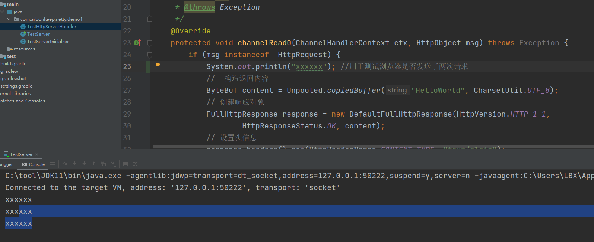

# Netty

## Netty的执行流程与组件分析
<br>

### 简单的HelloWorld程序

1. 创建一个测试的TestServer，HTTP的功能DEMO

```java

/**
 * @Author LBX
 * @Date 2021/4/24 18:55
 * @Description
 */
public class TestServer  {
    public static void main(String[] args) {
        //创建事件循环组
        EventLoopGroup bossGroup = new NioEventLoopGroup();//接收连接，交给workerGroup4处理
        EventLoopGroup workerGroup = new NioEventLoopGroup();
        try {
            ServerBootstrap serverBootstrap = new ServerBootstrap();
            serverBootstrap.group(bossGroup, workerGroup).channel(NioServerSocketChannel.class)
                    .childHandler(new TestServerInicialzer());  
                    //TestServerInicialzer的作用是在Chanel被注册好之后，会自动创建，执行里面代码

            //绑定端口，进行同步
            ChannelFuture channelFuture = serverBootstrap.bind(1001).sync();
        
            channelFuture.channel().closeFuture().sync();

        } finally {
            //关闭资源
            bossGroup.shutdownGracefully();
            workerGroup.shutdownGracefully();
        }

    }
}
```

2. 创建初始化器

```java

/**
 * @Author LBX
 * @Date 2021/4/24 18:57
 * @Description  
 */
public class TestServerInicialzer extends ChannelInitializer<SocketChannel> {

    @Override
    protected void initChannel(SocketChannel ch) throws Exception {
        ChannelPipeline pipeline = ch.pipeline();
        pipeline.addLast("httpServerCodec", new HttpServerCodec());
        //将处理器添加到管道
        pipeline.addLast("testServerHandler", new TestHttpServerHandler());
    }
}

```

3. 创建一个正真处理请求的处理器

```java

/**
 * @Author LBX
 * @Date 2021/4/24 19:06
 * @Description
 */
public class TestHttpServerHandler extends SimpleChannelInboundHandler<HttpObject> {
    /**
     * 读取客户端发送的请求
     * @param ctx
     * @param msg
     * @throws Exception
     */
    @Override
    protected void channelRead0(ChannelHandlerContext ctx, HttpObject msg) throws Exception {
       if (msg instanceof  HttpRequest) {  //此判断可以解决异常问题   
            //  构造返回内容
            ByteBuf content = Unpooled.copiedBuffer("HelloWorld", CharsetUtil.UTF_8);
            // 创建响应对象
            FullHttpResponse response = new DefaultFullHttpResponse(HttpVersion.HTTP_1_1,
                    HttpResponseStatus.OK, content);
            // 设置头信息
            response.headers().set(HttpHeaderNames.CONTENT_TYPE, "text/plain");
            response.headers().set(HttpHeaderNames.CONTENT_LENGTH, content.readableBytes());//通过读取文本字节来获取长度

            //响应客户端，使用writeAndFlush才是正真的返回给客户端，使用write  则会在缓冲区中
            ctx.writeAndFlush(response);
        }
    }

}

```  

4. 测试

- 如果是windows系统，可以在cmd中直接使用curl http://localhost:1001 进行测试，如果出现了Hello World 那么说明程序已经成功实现了。

## Netty回调与Chanel执行流程的分析


1. 对于上一个程序的理解

- 在运行上述程序时，发生一件有意思的事情。当我们使用浏览器去访问http://localhost:1001时，实际上是两次请求。而当我们使用curl指令进行操作时，<br>却是一次请求。这是什么原因呢？

```

    原因是：当我们使用浏览器时，在发送一个请求的url链接时，同时浏览器会发送一个请求图标的请求。

```

- 测试:

```

    我们可以在channelRead0()方法中，添加一行输出，同时使用curl和浏览器进行访问，如下图所示，当我们使用curl访问时，只输出了一行x而使用
    浏览器访问时，却输出了两行x，由此可见，使用浏览器访问是两个请求。
```



2. 探讨Channel的执行流程
- 程序改造
```
    我们首先将TestHttpServerHandler实现的接口SimpleChannelInboundHandler中未实现的方法进行实现。
```

```java
/**
 * @Author LBX
 * @Date 2021/4/24 19:06
 * @Description
 */
public class TestHttpServerHandler extends SimpleChannelInboundHandler<HttpObject> {
    /**
     * 读取客户端发送的请求,并进行处理
     * @param ctx
     * @param msg
     * @throws Exception
     */
    @Override
    protected void channelRead0(ChannelHandlerContext ctx, HttpObject msg) throws Exception {
        System.out.println(msg.getClass());//打印msg的类型
        System.out.println(ctx.channel().remoteAddress());//获取远程地址
        if (msg instanceof  HttpRequest) {
//            System.out.println("xxxxxx"); //用于测试浏览器是否发送了两次请求
            HttpRequest httpRequest = (HttpRequest) msg;
            System.out.println("该请求的请求方法是：" + httpRequest.getMethod());

            URI uri = new URI(httpRequest.uri());
            System.out.println(uri);
            if ("/favicon.ico".equals(uri.getPath())) {
                System.out.println("请求的uri是：" + uri);
                return;
            }

            //  构造返回内容
            ByteBuf content = Unpooled.copiedBuffer("HelloWorld", CharsetUtil.UTF_8);
            // 创建响应对象
            FullHttpResponse response = new DefaultFullHttpResponse(HttpVersion.HTTP_1_1,
                    HttpResponseStatus.OK, content);
            // 设置头信息
            response.headers().set(HttpHeaderNames.CONTENT_TYPE, "text/plain");
            response.headers().set(HttpHeaderNames.CONTENT_LENGTH, content.readableBytes());//通过读取文本字节来获取长度

            //响应客户端，使用writeAndFlush才是正真的返回给客户端，使用write  则会在缓冲区中
            ctx.writeAndFlush(response);
            ctx.channel().close();//手动关闭通道

        }
    }

    @Override
    public void handlerAdded(ChannelHandlerContext ctx) throws Exception {
        System.out.println("handlerAdded");
        super.handlerAdded(ctx);
    }

    @Override
    public void channelRegistered(ChannelHandlerContext ctx) throws Exception {
        System.out.println("channelRegistered");
        super.channelRegistered(ctx);
    }

    @Override
    public void channelActive(ChannelHandlerContext ctx) throws Exception {
        System.out.println("channelActive");
        super.channelActive(ctx);
    }

    @Override
    public void channelInactive(ChannelHandlerContext ctx) throws Exception {
        System.out.println("channelInactive");
        super.channelInactive(ctx);
    }

    @Override
    public void channelUnregistered(ChannelHandlerContext ctx) throws Exception {
        System.out.println("channelUnregistered");
        super.channelUnregistered(ctx);
    }
}

```
- 执行结果
```
    当我们使用curl进行访问时，这正是channel的正常执行流程。执行顺序如下所示：
        handlerAdded => channelRegistered => channelActive => channelRead0 => channelInactive => channelUnregistered

    但是，当我们使用浏览器进行访问时，第一次访问结果如下：
        handlerAdded => channelRegistered => channelActive => channelRead0
    
    再次访问，结果handlerAdded => channelRegistered => channelActive => channelRead0 => channelInactive => channelUnregistered

    还有一种情况，当我们使用浏览器访问时，访问一次，然后关闭浏览器。此时，控制台也会输出完整的流程。

```

- 提出思考
```
    那么，为什么会出现上面这样的情况呢？
        因为使用curl是一次完成的请求，请求之后会立刻结束。所以使用curl访问会出现完整流程。而使用浏览器发送http请求，如果是http1.1
        的版本，那么是一个长连接，会有一个keepalive的存活时间，不会立刻结束，会在这个时间过后才主动关闭连接。

    注意：在netty中http连接的关闭需要手动去关闭。如果我们手动关闭的话，那么浏览器访问在控制台就会出现一个完整的流程。但是顺序是无
          法保证的，因为浏览器访问时两个请求（还要请求图标）

```

- 实验
```
    我们打印一下远程的地址，同时，线程进行一个休眠，在休眠期间，是在进行socket通讯的。可以查看进程的端口号了解

```

## Netty的Socket编程详解

1.  Netty主要的三个作用

```
    <1> Socket开发，自定义协议（定义数据的格式）

    <2> HTTP长连接开发

    <3> 类似于springmvc的链接式开发

```

2. Netty实现Socket编程DEMO

- 服务端代码实现

``` java

/**
 * @Author LBX
 * @Date 2021/5/10 19:40
 * @Description
 */
public class TestServer {
    public static void main(String[] args) throws Exception {
        EventLoopGroup bossGroup = new NioEventLoopGroup();
        EventLoopGroup workerGroup = new NioEventLoopGroup();

        try {
            ServerBootstrap serverBootstrap = new ServerBootstrap();
            serverBootstrap.group(bossGroup, workerGroup).channel(NioServerSocketChannel.class)
                .childHandler(new TestServerInnitializer());
            //bind port
            ChannelFuture channelFuture = serverBootstrap.bind(1001).sync();
            channelFuture.channel().closeFuture().sync();
        }finally {
            bossGroup.shutdownGracefully();
            workerGroup.shutdownGracefully();
        }

    }


}

```

``` java

/**
 * @Author LBX
 * @Date 2021/5/10 20:06
 * @Description  指定泛型为String，传递的数据类型为String
 */
public class TestServerHandler extends SimpleChannelInboundHandler<String> {


    @Override
    protected void channelRead0(ChannelHandlerContext ctx, String msg) throws Exception {
        System.out.println(ctx.channel().remoteAddress() + ", " + msg);
        ctx.channel().writeAndFlush("服务器发送的消息:" + UUID.randomUUID().toString());
    }

    @Override
    public void exceptionCaught(ChannelHandlerContext ctx, Throwable cause) throws Exception {
        cause.printStackTrace();
        ctx.close();
    }
}

```

``` java

/**
 * @Author LBX
 * @Date 2021/5/10 19:55
 * @Description  innitialzer
 */
public class TestServerInnitializer extends ChannelInitializer<SocketChannel> {

    @Override
    protected void initChannel(SocketChannel ch) throws Exception {
        ChannelPipeline pipeline = ch.pipeline();

        pipeline.addLast(new LengthFieldBasedFrameDecoder(Integer.MAX_VALUE, 0 ,4, 0, 4));
        pipeline.addLast(new LengthFieldPrepender(4));
        pipeline.addLast(new StringEncoder(CharsetUtil.UTF_8));
        pipeline.addLast(new StringDecoder(CharsetUtil.UTF_8));
        pipeline.addLast(new TestServerHandler());//自定义handler

    }
}

```


- 客户端代码实现

```java

/**
 * @Author LBX
 * @Date 2021/5/10 20:34
 * @Description
 */
public class TestClient {
    public static void main(String[] args) throws Exception {
        EventLoopGroup eventLoopGroup = new NioEventLoopGroup();

        try {
            Bootstrap bootstrap = new Bootstrap();
            bootstrap.group(eventLoopGroup).channel(NioSocketChannel.class).handler(new TestClientInnitializer());

            ChannelFuture channelFuture = bootstrap.connect("localhost", 8001).sync();
            channelFuture.channel().closeFuture().sync();

        }finally {
            eventLoopGroup.shutdownGracefully();
        }

    }


}

```


```java
/**
 * @Author LBX
 * @Date 2021/5/10 20:48
 * @Description
 */
public class TestClientHandler extends SimpleChannelInboundHandler<String > {

    @Override
    protected void channelRead0(ChannelHandlerContext ctx, String msg) throws Exception {
        System.out.println(ctx.channel().remoteAddress() + "来自服务端的数据：" + msg);
        ctx.writeAndFlush("发给服务端的数据：" + System.currentTimeMillis());
    }

    @Override
    public void exceptionCaught(ChannelHandlerContext ctx, Throwable cause) throws Exception {
        cause.printStackTrace();
        ctx.close();
    }
}

```


```java
/**
 * @Author LBX
 * @Date 2021/5/10 20:41
 * @Description
 */
public class TestClientInnitializer extends ChannelInitializer<SocketChannel> {

    @Override
    protected void initChannel(SocketChannel ch) throws Exception {
        ChannelPipeline pipeline = ch.pipeline();
        pipeline.addLast(new LengthFieldBasedFrameDecoder(Integer.MAX_VALUE, 0, 4, 0, 4));
        pipeline.addLast(new LengthFieldPrepender(4));
        pipeline.addLast(new StringEncoder(CharsetUtil.UTF_8));
        pipeline.addLast(new StringDecoder(CharsetUtil.UTF_8));
        pipeline.addLast(new TestClientHandler());


    }
}

```

- 问题总结

```
   <1> 在TestServer和TestClient中childHandler与handler方法之间的区别
        
        (1) 在服务端中可以使用handler也能使用childHandler，在客户端中只能使用handler方法

        (2) 而在服务器中，如果使用的是handler方法的话，那么是针对bossGroup起作用，而childHandler则是针对workGroup起作用

```


